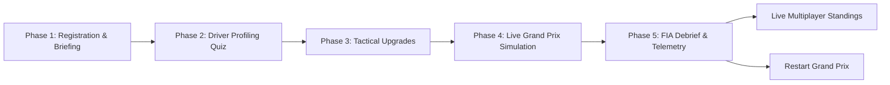

# F1 Strategy Quest 2.0 — Architecture, Physics, Parameters & Scenario Master Specification

> **Target Audience:** Engineering, AI Assistants (Claude / Antigravity), Game Designers, and Race Engineers.  
> **Purpose:** Comprehensive deep-dive specification of the Strategy Simulation module (`hub/src/strategy-sim/`), its telemetry physics, event state machine, scoring models, and integration with the master Supabase Hub.

---

## 1. System Overview & Lifecycle

The **F1 Strategy Simulation** is a multi-phase, turn-based/decision-window Grand Prix tactical simulator designed for up to 70+ participants in live warfare. Candidates act as **Team Principals / Pit Wall Strategists** guiding a car across a 60-lap race distance.

### Phase Progression Workflow



1. **Phase 1 — Registration & Briefing (`PhaseRegistration.tsx`):**
   - Pre-fills Team Principal with the candidate's authenticated Hub name (`user.name`).
   - Collects Candidate Team Name (Avatar / Constructor name).
   - Displays Race Directives: Weather alerts, thermal thresholds, Sporting Regulations.
2. **Phase 2 — Psychological Driver Assessment (`PhaseDriverQuiz.tsx`):**
   - 5 tactical scenarios test candidate decision-making.
   - Computes persistent driver personality telemetry attributes (`DriverProfile`).
3. **Phase 3 — Factory & Tactical Upgrades (`PhaseUpgrades.tsx`):**
   - Budget allocation ($100M virtual cap) to select performance packages.
   - Directly injects physics multipliers into simulation algorithms.
4. **Phase 4 — Live Grand Prix Simulation (`PhaseLiveRace.tsx`):**
   - Iterative stints advancing 4 to 7 laps per decision window.
   - Dynamic real-time event generator triggered by telemetry state thresholds.
   - 4 action choices: **PUSH**, **SAVE TIRES**, **DEFEND**, **PIT (with compound selection)**.
5. **Phase 5 — Official FIA Debrief (`PhaseDebrief.tsx`):**
   - Calculates score breakdown across 7 vectors.
   - Renders Superlicense Rank Grade (S, A, B, C, D, F).
   - Writes record directly to Supabase table `strategy_scores`.

---

## 2. Core Telemetry State Parameters (`RaceState`)

Every stint window consumes and mutates a single `RaceState` object (`hub/src/strategy-sim/types/index.ts`):

| Parameter | Type / Range | Initial Value | Description & Physics Role |
| :--- | :--- | :--- | :--- |
| `lap` | `number` (1 – 60) | `1` | Current race lap. Reaching 60 triggers `Finished`. |
| `position` | `number` (1 – 20) | `P5` to `P14` (random) | On-track track position. |
| `tire_health` | `number` (0 – 100%) | `100%` | Physical rubber integrity. Below 30% enters "cliff". Below 25% enters blowout danger. |
| `tire_compound` | `Compound` | `'Medium'` | `'Soft'`, `'Medium'`, `'Hard'`, `'Intermediate'`, `'Wet'`. |
| `tire_age` | `number` | `0` | Number of laps completed on current set of rubber. |
| `track_dampness` | `number` (0 – 100%) | `0%` | Standing water & rain saturation. Controls aquaplaning and crossover windows. |
| `fuel_load` | `number` (kg) | `110.0 kg` | Fuel weight. Reaching 0.0 kg causes instant **DSQ**. |
| `ers_percent` | `number` (0 – 100%) | `100%` | Hybrid battery state of charge (MGU-K / MGU-H). |
| `gap_ahead` | `number` (seconds) | `1.2s – 5.2s` | Delta to car ahead. Decreased by overtakes, increased by pits/penalties. |
| `gap_behind` | `number` (seconds) | `1.5s – 5.5s` | Delta to chaser behind. Defending maintains or widens this buffer. |
| `reliability` | `number` (0 – 100%) | `100%` | Power unit, hydraulics, gearbox and brake condition. |
| `driver_confidence`| `number` (0 – 100%) | `100%` | Driver mental focus. Below 50% multiplies lockups, fuel burn, and tire wear. |
| `pit_stops` | `number` | `0` | Cumulative pit stop counter. |
| `risk_efficiency` | `number` | `50` | Score tracker rewarding successful high-risk maneuvers. |
| `resource_mgmt` | `number` | `50` | Score tracker rewarding tire/fuel/reliability preservation. |
| `strategy_bonus` | `number` (pts) | `0` | Running balance of tactical bonuses and sporting penalties. |
| `fastest_lap_bonus`| `number` | `0` (or `50`) | Awarded if pushing on Soft tires with low fuel (< 35kg). |
| `status` | `string` | `'Racing'` | `'Racing'`, `'Finished'`, `'DNF - Tire Blowout'`, `'DNF - Crash in Wet'`, `'DNF - Engine Failure'`, `'DSQ - Out of Fuel'`. |

---

## 3. Tire Compounds & Weather Physics

### 3.1 Compound Base Wear Rates

```
Base Wear Rate (activeCompound):
- Soft:         1.6x   (Fastest, massive degradation, high risk of cliff)
- Medium:       1.0x   (Baseline balanced race tire)
- Hard:         0.7x   (Low degradation, durable, lower grip)
- Intermediate: 1.2x   (Grooved crossover tire for damp / light rain)
- Wet:          1.0x   (Deep tread for standing water & torrential rain)
```

### 3.2 Wear Modifiers & Calculation Formula

Total wear applied per turn:
$$\text{wearRate} = \text{baseRate} \times \text{driverTireMod} \times \text{upgradeMod} \times \text{confidenceMod} \times \text{weatherMismatchMod}$$

1. **Driver Skill Modifier:**
   $$\text{driverTireMod} = 1.5 - \frac{\text{driverProfile.tire\_management}}{100.0}$$
   *(A driver with 90 tire management drops wear to 0.6x; a 40-rated driver increases wear to 1.1x)*.
2. **Pirelli Compound Specialists Upgrade:**
   $$\text{hasTireEng} \implies \text{wearRate} \times 0.8 \quad (-20\%\text{ wear reduction})$$
3. **Driver Confidence Interlink:**
   $$\text{driver\_confidence} < 50 \implies \text{wearRate} \times \text{config.confidenceWearMultiplier} \ (1.25\times)$$
4. **Weather Mismatch Degradation:**
   - **Wet/Inters on Dry Track (`track_dampness < 20%`):**  
     $$\text{wearRate} \times 3.0 \quad \text{and} \quad \text{gap\_ahead} += (20 - \text{dampness}) \times 0.15\text{s}$$
   - **Slicks on Damp/Wet Track (`track_dampness > 15%`):**  
     Drains driver confidence by -15% per stint window.
   - **Slicks in Torrential Rain (`track_dampness > 30%`):**  
     $$\text{gap\_ahead} += (\text{dampness} - 30) \times 0.2\text{s} \quad \text{and} \quad \text{reliability} -= \text{random}(6\text{ to }13)\%$$

### 3.3 The Tire Performance Cliff (<30% Health)
When rubber falls below 30%:
$$\text{gap\_ahead} += (30 - \text{tire\_health}) \times 0.25\text{s}$$
*(At 10% health, the car loses +5.0 seconds per stint simply from lack of traction).*

---

## 4. Decision Actions Matrix & Interlinks

Every decision window, the player selects one of 4 tactical orders:

### 1. PUSH (Maximum Attack)
- **Tire Wear:** $\text{random}(12 \text{ to } 22) \times \text{wearRate}$
- **Overtake Success Check:**  
  $$\text{successChance} = \frac{\text{driverProfile.aggression} + \text{driver\_confidence}}{2}$$
  - **Success:** Position improved by -1 ($P_{new} = \max(1, P-1)$), and $\text{gap\_ahead} = \text{random}(0.6 \text{ to } 2.1)\text{s}$.
  - **Fail:** Overtake fails; $\text{gap\_ahead} += \text{random}(0.5 \text{ to } 1.3)\text{s}$.
- **Fuel Consumption:** Burn between $3.5\text{kg}$ and $5.0\text{kg}$.
  - *If $\text{driver\_confidence} < 50$*: Burn increased by +15% ($1.15\times$) due to erratic throttle modulation.
- **ERS Hybrid Drain:** -20% to -34% battery.
  - *If $\text{reliability} < 45$*: MGU-K clipping triggers $1.5\times$ ERS drain multiplier.
- **Interlink with Dead Tires:**  
  If $\text{tire\_health} < 35\%$, pushing induces severe chassis vibration:
  $$\text{reliability} -= \text{random}(8 \text{ to } 17)\% \quad \text{and} \quad \text{resource\_management} -= 15$$
- **Fastest Lap Trigger:**  
  If $\text{Compound} == \text{'Soft'} \land \text{fuel\_load} < 35\text{kg} \land \text{tire\_health} > 45\%$:
  $$\text{fastest\_lap\_bonus} = 50\text{ pts}$$

### 2. SAVE TIRES (Conservation & Lift-and-Coast)
- **Tire Wear:** Minimal wear: $\text{random}(3 \text{ to } 7) \times \text{wearRate}$.
- **Pace Impact:** Drops $\text{gap\_ahead} += \text{random}(0.8 \text{ to } 1.8)\text{s}$.
- **Fuel Economy:** Consumes only $1.2\text{kg}$ to $2.0\text{kg}$.
- **ERS Harvesting:** Recovers +20% to +34% battery charge.
  - *If $\text{reliability} < 45$*: Energy recovery restricted: $\text{ersGain} \times 0.6$.
- **Mental Rebuild:** Restores +5% driver confidence.
- **Resource Management Score:** $+15\text{ pts}$.

### 3. DEFEND (Track Position Defense)
- **Tire Wear:** Moderate wear: $\text{random}(8 \text{ to } 14) \times \text{wearRate}$.
- **Gap Behind:** Defends against DRS attacks; buffer increases:
  $$\text{gap\_behind} += \text{random}(0.6 \text{ to } 1.8)\text{s}$$
- **ERS Deployment:** Uses defensive energy boost: -12% to -21% battery.
- **Risk Efficiency Score:** $+6\text{ pts}$.

### 4. PIT (Box This Lap for New Tires)
- **Tire Reset:** $\text{tire\_health} \to 100\%$, $\text{tire\_age} \to 0$, $\text{pit\_stops} += 1$.
- **Pit Lane Time Loss:**
  - Standard Pit Loss: $+23.0\text{s}$ added to $\text{gap\_ahead}$.
  - **Elite Pit Crew Upgrade:** $+18.5\text{s}$ added (saving $4.5\text{s}$ stationary).
- **Crossover Timing Bonuses & Blunders:**
  - **Perfect Rain Crossover:** Box for Inters/Wets when $\text{dampness} > 28\%$:
    $$\text{strategy\_bonus} += +50\text{ pts} \quad (\text{Perfect Crossover Masterclass})$$
  - **Cliff-Edge Box:** Box when $\text{tire\_health} < 30\%$:
    $$\text{strategy\_bonus} += +25\text{ pts} \quad (\text{Timely Pit Stop})$$
  - **Weather Blunder:** Box for Inters/Wets when $\text{dampness} < 18\%$:
    $$\text{strategy\_bonus} += -40\text{ pts} \quad (\text{Wrong Tire for Weather})$$

---

## 5. Critical FIA Technical & Sporting Regulations (DNFs & DSQs)

The simulation enforces catastrophic failure mechanics if the car is pushed beyond physiological or mechanical limits:

```mermaid
graph TD
    A[Stint Action Triggered] --> B{Check Critical Thresholds}
    B -->|Tires < 25% + Push| C[60% Chance: DNF - Tire Blowout (-100 pts)]
    B -->|Tires < 25% + Defend| D[30% Chance: Minor Puncture +14s penalty]
    B -->|Dampness > 30% on Slicks + Push/Defend| E[65% Chance: DNF - Crash in Wet (-130 pts)]
    B -->|Fuel <= 0.0 kg| F[100% Guaranteed: DSQ - Out of Fuel (-150 pts)]
    B -->|Reliability < 25% + Push| G[70% Chance: DNF - Engine Failure (-120 pts)]
```

### Exact Regulations & Math:
1. **Tire Delamination Blowout:**
   - Condition: `currentState.tire_health < 25%` and decision is `Push`.
   - Result: 60% probability of high-speed delamination:
     `status = 'DNF - Tire Blowout'`, `reliability = 0`, `driver_confidence = 0`, `strategy_bonus -= 100`
2. **Wet Aquaplaning Barrier Crash:**
   - Condition: `track_dampness > 30%` while on dry slick tires (`Soft`, `Medium`, `Hard`) and decision is `Push` or `Defend`.
   - Result: 65% probability of aquaplaning:
     `status = 'DNF - Crash in Wet'`, `strategy_bonus -= 130`, `resource_mgmt -= 50`
3. **Fuel Starvation Disqualification (FIA Tech Reg 6.6.2):**
   - Condition: `nextState.fuel_load <= 0.0 kg`.
   - Result: Immediate car shutdown:
     `status = 'DSQ - Out of Fuel'`, `strategy_bonus -= 150`
4. **Hydraulic / Power Unit Thermal Explosion:**
   - Condition: `currentState.reliability < 25%` and decision is `Push`.
   - Result: 70% probability of catastrophic detonation:
     `status = 'DNF - Engine Failure'`, `strategy_bonus -= 120`

---

## 6. Real-Time Scenario Engine (`getLogicalEvent()`)

The engine does not pick scenarios randomly. It uses a **weighted telemetry probability distribution** based on live sensor data:

```typescript
// Weight calculation excerpt from simulationEngine.ts:
if (dampness > 20 && evt.event_type === 'Weather Shift')    weight = 16.0;
if (tireHealth < 35 && evt.event_type === 'Tire Wear')       weight = 20.0;
if (reliability < 40 && evt.event_type === 'Subsystem Issue') weight = 15.0;
if (gapAhead < 1.5 && evt.event_type === 'Track Position')   weight = 12.0;
if (evt.event_type === 'Safety Car')                         weight = 3.0;
```

### The 6 Scenario Categories (30 Total Scenarios in `events.ts`):
1. **Weather Shift (`EVT-WTH-01` to `05`):** Rain cells, crossover points, strong crosswinds, torrential downpours.
2. **Safety Car (`EVT-SFC-01` to `05`):** Full SC, Virtual Safety Car, Red Flag restarts, cheap pit windows, double-stacking risks.
3. **Tire Wear & Thermal (`EVT-TIR-01` to `05`):** Thermal blistering, graining on green track, slow punctures, cold tire restarts.
4. **Subsystem & Reliability (`EVT-SUB-01` to `05`):** Hybrid battery overheating, inconsistent brake feel, floor damage from curb strikes, hydraulic pressure loss.
5. **Track Position & Traffic (`EVT-TRK-01` to `05`):** DRS trains, undercut threats from undercutters, lapping backmarkers, fuel delta warnings, track limits warnings.
6. **Driver Psychology & State (`EVT-DRV-01` to `04`):** Driver rattled after spin, strange vibration feedback, fatigue in hot stint, finding rhythm.

Every scenario includes a **`hidden_impact`** (ranging from -20 to +10 points) applied directly to `strategy_bonus` to capture unseen tactical outcomes.

---

## 7. Driver Psychology Profiling (`PhaseDriverQuiz.tsx`)

In Phase 2, candidates answer 5 high-pressure questions. Their answers ($1 = \text{Elite Strategic}, 4 = \text{Impulsive Panic}$) generate a 5-dimensional personality profile:

```typescript
// Physics mapping from quizQuestions.ts:
tire_management = clamp(35, 99, 100 - ((Q1 - 1) * 18) - ((Q3 - 1) * 10));
aggression      = clamp(35, 99, 35 + (Q4 * 14) + (Q5 * 8));
risk_appetite   = clamp(35, 99, 30 + (Q4 * 12) + (Q2 * 10));
data_reliance   = clamp(35, 99, 100 - ((Q2 - 1) * 20) - ((Q1 - 1) * 8));
adaptability    = clamp(35, 99, 100 - ((Q3 - 1) * 18) - ((Q5 - 1) * 10));
```

### Impact on Physics:
- **`tire_management`**: Directly scales `wearRate`. High stat saves up to 40% tire life.
- **`aggression`**: Increases overtake probability during `Push`, but elevates tire heat.
- **`risk_appetite`**: Modulates tactical risk thresholds.
- **`data_reliance`**: Higher reliance provides cleaner AI predictive telemetry.
- **`adaptability`**: Accelerates recovery of `driver_confidence` following lockups or track incidents.

---

## 8. Tactical Factory Upgrades (`upgrades.ts`)

Candidates have a **$100M budget** in Phase 3 to select from 5 factory upgrades:

| Upgrade Package | Cost | In-Game Mechanics & Physics Effect |
| :--- | :--- | :--- |
| **Elite Pit Crew** | $30M | Drops stationary pit lane loss from **23.0s down to 18.5s** (-4.5s per stop). |
| **Weather Doppler Radar** | $40M | Unlocks live radar telemetry, providing 4-lap predictive rain intensity alerts. |
| **AI Pit Wall Strategist** | $50M | Runs live Monte Carlo projections, displaying real-time recommended decisions. |
| **Reliability & Cooling Package** | $35M | Reduces natural subsystem degradation rate by **50%**, preventing engine DNFs. |
| **Pirelli Compound Specialists** | $45M | Directly cuts base tire wear rate by **20%** across all compounds. |

---

## 9. Scoring Engine & Superlicense Classification

The final score (0 to 1000 points) is computed in `scoringEngine.ts` across 7 distinct vectors:

$$\text{Total Score} = \text{Race Result} + \text{Strategy Accuracy} + \text{Tire Mgmt} + \text{Fuel/ERS} + \text{Car Preservation} + \text{Driver Confidence} + \text{Fastest Lap}$$

### Vector Breakdown:
1. **Race Result Score (Max 500 pts):**  
   F1 Official Points Table scaled to 500:
   - P1 = 500, P2 = 360, P3 = 300, P4 = 240, P5 = 200
   - P6 = 160, P7 = 120, P8 = 80, P9 = 40, P10 = 20, P11+ = 10
   - *DNFs / DSQs score 0 pts.*
2. **Strategy Accuracy (Max 150 pts):**  
   $$\text{clamp}\left(0, 150, 50 + \text{strategy\_bonus} + \text{round}(\text{risk\_efficiency} \times 0.8)\right)$$
3. **Tire Preservation (Max 120 pts):**  
   $$\text{clamp}\left(0, 120, \text{round}(\text{tire\_health} \times 1.2)\right) \quad (\text{Only if Finished})$$
4. **Fuel & ERS Energy Efficiency (Max 100 pts):**  
   $$\text{clamp}\left(0, 100, \text{round}\left(\frac{\text{fuel\_load}}{110.0} \times 50 + \frac{\text{ers\_percent}}{100.0} \times 50\right)\right)$$
5. **Car Reliability Preservation (Max 80 pts):**  
   $$\text{clamp}\left(0, 80, \text{round}(\text{reliability} \times 0.8)\right)$$
6. **Driver Confidence & Synergy (Max 50 pts):**  
   $$\text{clamp}\left(0, 50, \text{round}(\text{driver\_confidence} \times 0.5)\right)$$
7. **Fastest Lap Bonus (Max 50 pts):**  
   +50 pts if unlocked during stint attack.

### Superlicense Rank Grades:
- **Grade S (Grand Prix Legend):** Total Score >= 850
- **Grade A (Master Strategist):** 700 <= Score < 850
- **Grade B (Solid Points Finish):** 500 <= Score < 700
- **Grade C (Midfield Scrapper):** 300 <= Score < 500
- **Grade D (Backmarker):** Score < 300
- **Grade F (Disqualified / DNF):** Failed to complete 60 laps due to mechanical blowout, crash, or fuel starvation.

---

## 10. Database Schema & Hub Interlinks

The Strategy Round records its data to the unified Supabase instance (`https://fbgtqcogaykvdtysqmsz.supabase.co`):

```sql
-- Table: public.strategy_scores
CREATE TABLE IF NOT EXISTS public.strategy_scores (
  id              uuid DEFAULT gen_random_uuid() PRIMARY KEY,
  bits_id         text REFERENCES hub_users(bits_id) ON DELETE CASCADE,
  name            text NOT NULL,               -- Candidate real name from Hub
  principal_name  text,                        -- Custom strategist name
  team_name       text,                        -- Constructor avatar / team name
  score           int DEFAULT 0,               -- Total score computed by scoring engine
  race_position   int DEFAULT 20,              -- P1 to P20
  race_status     text DEFAULT 'Racing',       -- 'Finished', 'DNF - ...', 'DSQ'
  rank_grade      text DEFAULT '',             -- 'Grade S', 'Grade A', etc.
  decisions_count int DEFAULT 0,               -- Number of strategic choices made
  updated_at      timestamptz DEFAULT now(),
  UNIQUE(bits_id)
);
```

### Save Routine in `StrategyApp.tsx`:
On lap 60 or terminal DNF, `handleRaceFinish()` calls:
```typescript
await supabase.from('strategy_scores').upsert({
  bits_id: user.bitsId,
  name: user.name,
  principal_name: principalName,
  team_name: teamName,
  score: breakdown.total_score,
  race_position: finalState.position,
  race_status: finalState.status,
  rank_grade: breakdown.rank_grade,
  decisions_count: logs.length,
  updated_at: new Date().toISOString()
}, { onConflict: 'bits_id' });
```
This guarantees an atomic update with zero data loss or duplicate key conflicts.